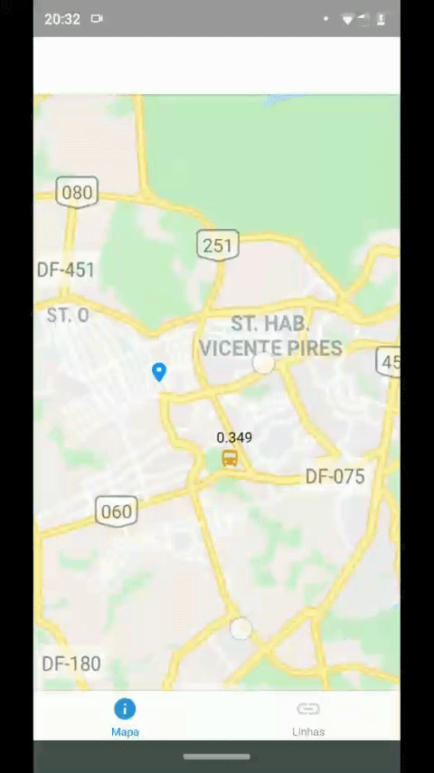

<p align="center">
   
</p>

# :bus: MyBus DF 

<p align="center">
    <a href="https://github.com/yagoernandes">
        
    </a>
    <a href="#">
        
    </a>
    <a href="https://github.com/yagoernandes/myBusDf/stargazers">
        
    </a>
    <br />
    <a href="https://twitter.com/intent/follow?screen_name=yagoernandes">
        </a>
</p>

> :bus: Aplicativo de localização de ônibus do Distrito Federal utilizando a API da Secretaria de Mobilidade Urbana (sem documentação).

## :heavy_check_mark: Resultado no aplicativo

<p align="center"></p>

# :rocket: Features

* Visualize a localização do seu ônibus em tempo real.
* Monitore quantas linhas desejar.
* Altere a cor das linhas para fácil identificação.


# :construction_worker: Instalação

**É necessário instalar o [Node.js](https://nodejs.org/en/download/) e o [Yarn](https://yarnpkg.com/) antes**

Para clonar o projeto via HTTPS:
```shell
git clone https://github.com/yagoernandes/myBusDf.git
```

Instale as dependências:
```shell
yarn install
```

Execute o Expo em modo de desenvolvimento:
```shell
yarn start
```

## :postbox: Faq

**Quais as tecnologias utilizadas nesse projeto?**

- [NodeJS](https://nodejs.org/en/)
- [React Native](https://reactnative.dev/)
- [Expo](https://expo.io/)
- [Google Maps API](https://cloud.google.com/maps-platform?hl=pt-br)
##


---

<p align="center">
Made with :heart: by <a href="https://www.linkedin.com/in/yagoernandes">YagoErnandes</a>
</p>